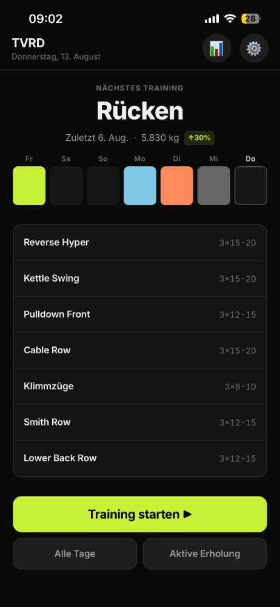
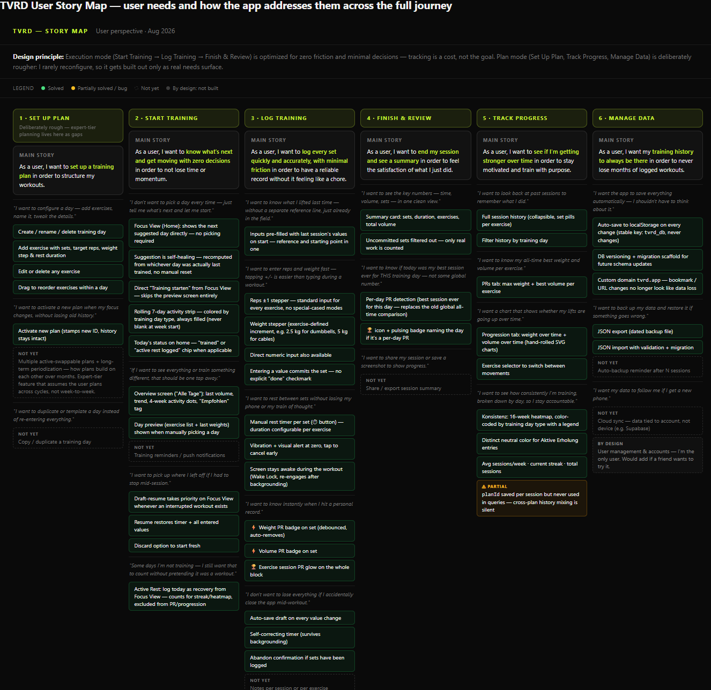
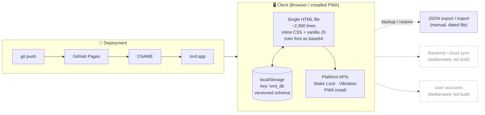
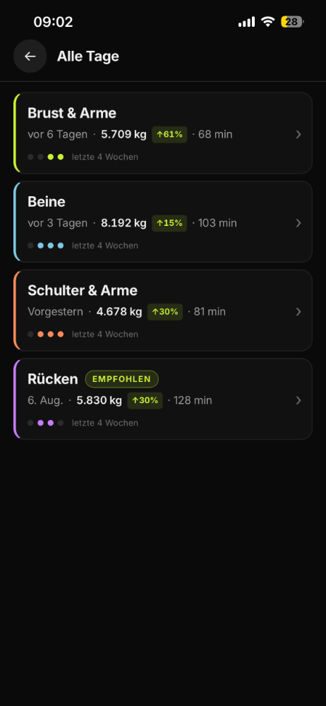
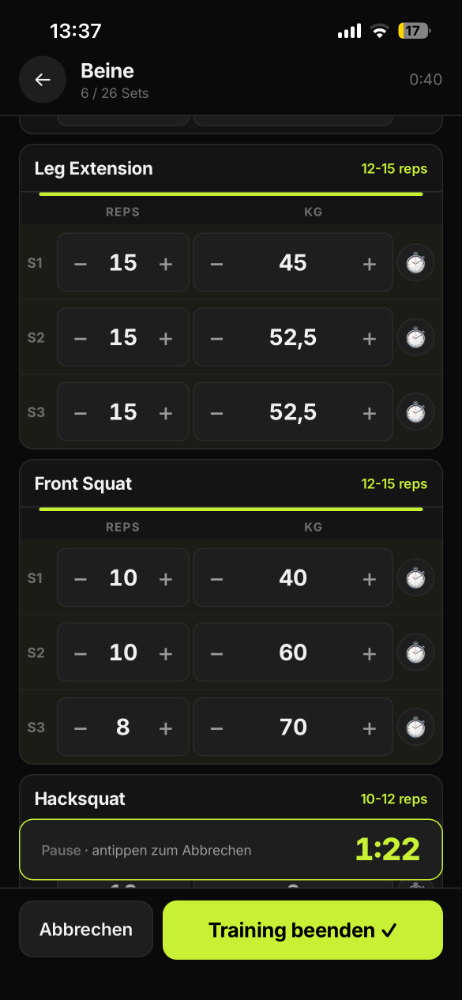

# TVRD

A training tracker I built for myself and use every session. Six workouts a week, heavy-user territory.

**Live:** [tvrd.app](https://tvrd.app). Single-file web app, installable to the home screen.

> *tvrd* is Bosnian for "hard / tough."

**n=1 by design.** I'm the only user. This isn't a product case study with a user base and dashboards. It's the tool I wanted, built and iterated in the open. What this README covers: the thinking, the built-in restraint, and how it was made.

---

## Why it exists

I tracked workouts in a Google Sheet. Entry was tedious. I tried the fitness apps and hit the same problem every time: none of them focus on the one thing I actually want to do, which is log a set as fast as possible and get back to the workout. Too many features I don't use, constant upselling, no respect for the fact that I open the app under load, not on the couch.

**A second reason showed up during the build.** Halfway through I realized this could double as a portfolio piece: how do I actually work with AI, rather than just claim to. So a bit of visual polish went on top after the function was solid. **Function stays the priority.** The design is deliberately MVP. Clear enough to demo, not a design showcase. If that reads as unfinished in places, it is. Those places aren't causing me friction yet, so I haven't spent on them.

---

## Foundational principles

Four principles set the direction from the beginning. Each one has a specific place in the product where it shows up.

**Focus over features.** Only what supports the actual training. No social feed, no gamification loops, no muscle-group encyclopedia. The home screen has one primary action.

**Function first, form second.** Design is MVP-grade on purpose. It looks fine. It isn't trying to look great. Every hour spent on polish is an hour not spent on friction I'd feel during a workout.

**Good enough is perfect.** I build when a real need surfaces, not before. Cloud sync isn't there because I train on one device. Multi-plan switching isn't there because I run one plan at a time. Cost/benefit, not completeness.

**Built for heavy users.** Assumes someone who trains often and knows their weights. Preset weight increments per exercise (2.5 kg for dumbbells, 5 kg for cables), no onboarding flow, no explainer overlays. If you don't already know what a "set" is, this isn't for you.

---

## How the focus mode works

Every decision below exists to reduce something specific I noticed getting in my way.

**No choosing.** The home screen shows the next training day directly. No picker, no calendar view first. One button: *Training starten*.

**The suggestion heals itself.** The app rotates through the plan, but it recomputes from whichever day I actually trained last. Skip a day, train out of order, come back after a week, and it picks up from wherever I am. No manual reset.

**Inputs are pre-filled with the last session's values.** Reps and weight are already in the field when the workout starts. Same weight? One tap and done. Small change? Tap `+` twice. That's usually the whole interaction.

**Big steppers for reps and weight.** A `−` and `+` on either side of a large number, sized for a sweaty thumb. Typing on a phone keyboard during a set is friction I don't accept. Direct numeric input is still there if I need it.

**Weight increments are preset per exercise.** Dumbbell exercises step in 2.5 kg. Cables step in 5 kg. I set this once when I built the plan, and from then on `+` moves by the right amount. No "which weight is next" math mid-set.

**Entering a value commits the set.** There used to be a separate `✓` checkmark. It's gone. Typing or tapping a stepper marks the set as done. One less tap, every set, every workout.

**Rest timer is one tap per set.** A small ⏱ icon on each row, with a duration I configured once per exercise. Ticks down in a banner, vibrates and flashes at zero, tap anywhere on the banner to cancel.

**Screen stays awake mid-workout** (Wake Lock API), and re-engages automatically if I background the tab. My phone never locks in the middle of a set.

**Auto-save on every change.** Every value I enter is persisted immediately. If the app crashes or I close the tab, I open it and pick up exactly where I was. The home screen offers to resume.

**No decorations during the set.** No motivational quotes, no confetti on every rep, no ads. When I hit a PR, the badge appears for two seconds and self-removes. That's the entire ceremony.

---

## How I built it with AI

I didn't write the code. I directed it.

I set the direction, made the product decisions, and reviewed every change. Claude Code (Anthropic's CLI) did the implementation. The split is deliberate and it isn't hidden: **every recent commit in this repo is co-authored by Claude.** The git history is the honest record of how this was built.

The most useful thing I brought wasn't the code. It was using the app for real.

**A bug only daily use would catch.** The home screen told me I'd trained back "yesterday" when I'd actually trained it two days earlier. I reported exactly that. It turned out the app measured "last trained" in elapsed 24-hour blocks instead of calendar days, so a Saturday-evening session read as "yesterday" on Monday morning. The same flaw was sitting in two other places, the week dots and the consistency heatmap, where it would have drifted by a day too. Precise direction from real use turned a one-line symptom into a fix for a whole class of bug, instead of a patch on the surface.

That's the loop. I bring the ground truth and the judgment, the AI brings the implementation, and reviewing the output critically is the actual job. Accepting it isn't.

---

## User story map

The full picture of what the app is trying to do for the user, broken down across the whole training journey: solved, partial, deliberately not built, still on the list.

→ **[Open the interactive story map](https://tvrd.app/docs/story-map.html)**

---

## Plan mode

Deliberately rougher than execution mode. I open it rarely, usually just to add or swap an exercise, so it hasn't earned the same design attention. Same cost/benefit logic that runs the whole project: build when a real need shows up.

The interesting thing this mode does *not* do yet: **multi-plan activation and long-term periodization.** Swap between several active plans, and see how they build on each other across months. It assumes the user plans across cycles, not week to week. On the list, not built.

---

## What I deliberately did not build

At n=1, knowing what to leave out is most of the work.

- **Cloud sync.** `localStorage` only. A backend would let data survive a new phone; for a single-device personal tool the complexity isn't worth it yet.
- **Multiple active plans.** One plan at a time. See above.
- **User management / accounts.** I'm the only user. Would add if a friend wants to try it.
- **RPE (Rate of Perceived Exertion).** Standard in strength apps, where the user tags each set with how hard it felt. Useful for programming, not for how I currently train. Might add later.
- **Reminders / notifications.** The app doesn't nag. I open it when I train.
- **Per-muscle-group analytics.** Interesting, not needed for how I actually use it.

---

## Known limitations

Stated plainly, because a tool you use daily has real edges:

- **Data is device-bound.** `localStorage` lives in one browser on one device. The custom domain fixed the "bookmark change looks like data loss" problem, but it does **not** sync across devices. Backup and restore are manual JSON export/import.
- **Cross-plan history mixes silently.** Each session stores its `planId`, but nothing filters on it yet. Activate a new plan and old sessions still count toward the stats.
- **Migration scaffold, no migrations yet.** There's versioned-schema plumbing for zero-downtime data upgrades, but the app is still on v1, so it's untested in practice.

---

## Tech

- **One HTML file.** ~2,300 lines, HTML + CSS + JS inline. No framework, no build step, no dependencies. The Inter font is embedded as base64, so there isn't even a network request for it.
- **Persistence:** `localStorage`, versioned schema with a migration scaffold. Backup and restore via JSON file (manual).
- **Charts:** hand-rolled inline SVG, no charting library.
- **Platform APIs:** Wake Lock (screen stays on mid-workout), Vibration (rest-timer alert), installable PWA (standalone, custom home-screen icon).
- **Deploy:** GitHub Pages with a custom domain via `CNAME`. Push to `main` deploys.
- **No backend, no auth, no analytics.** By design. See above.

---

## Screens

  
  

