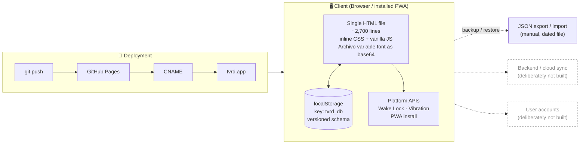

# TVRD

A training tracker I built for myself and use every session. Six workouts a week, heavy-user territory.

**Live:** [tvrd.app](https://tvrd.app). Single-file web app, installable to the home screen.

> *tvrd* is Bosnian for "hard / tough."

**n=1 by design.** I'm the only user. This isn't a product case study with a user base and dashboards. It's the tool I wanted, built and iterated in the open. What this README covers: the thinking, the built-in restraint, and how it was made.

---

## Why it exists

I tracked workouts in a Google Sheet. Entry was tedious. I tried the fitness apps and hit the same problem every time: none of them focus on the one thing I actually want to do, which is log a set as fast as possible and get back to the workout. Too many features I don't use, constant upselling, no respect for the fact that I open the app under load, not on the couch.

**A second reason showed up during the build.** Halfway through I realized this could double as a portfolio piece: how do I actually work with AI, rather than just claim to. **Function stayed the priority** and got built first. For a long stretch the design was deliberately MVP-grade: clear enough to demo, nothing more.

That changed once the function was genuinely done. The app worked exactly how I wanted, and the look was the only thing still saying "side project, theme taken off the shelf." So I did a deliberate design pass. [What that was and how it went is its own section.](#the-design-overhaul)

---

## Foundational principles

Four principles set the direction from the beginning. Each one has a specific place in the product where it shows up.

**Focus over features.** Only what supports the actual training. No social feed, no gamification loops, no muscle-group encyclopedia. The home screen has one primary action.

**Function first, form second, in that order, not instead of.** Every hour spent on polish while the function still had friction would have been an hour spent wrong. So the design stayed MVP-grade on purpose until the app genuinely did its job. Then form got its own pass, with the same rule applied to it: nothing that costs a tap during a set.

**Good enough is perfect.** I build when a real need surfaces, not before. Cloud sync isn't there because I train on one device. Multi-plan switching isn't there because I run one plan at a time. Cost/benefit, not completeness.

**Built for heavy users.** Assumes someone who trains often and knows their weights. Preset weight increments per exercise (2.5 kg for dumbbells, 5 kg for cables), no onboarding flow, no explainer overlays. If you don't already know what a "set" is, this isn't for you.

---

## How the focus mode works

Every decision below exists to reduce something specific I noticed getting in my way.

**No choosing.** The home screen shows the next training day directly. No picker, no calendar view first. One button: *Training starten*.

**The suggestion heals itself.** The app rotates through the plan, but it recomputes from whichever day I actually trained last. Skip a day, train out of order, come back after a week, and it picks up from wherever I am. No manual reset.

**Inputs are pre-filled with the last session's values.** Reps and weight are already in the field when the workout starts. Same weight? One tap and done. Small change? Tap `+` twice. That's usually the whole interaction.

**Big steppers for reps and weight.** A `−` and `+` on either side of a large number, sized for a sweaty thumb. Typing on a phone keyboard during a set is friction I don't accept. Direct numeric input is still there if I need it.

**Weight increments are preset per exercise.** Dumbbell exercises step in 2.5 kg. Cables step in 5 kg. I set this once when I built the plan, and from then on `+` moves by the right amount. No "which weight is next" math mid-set.

**Entering a value commits the set.** There used to be a separate `✓` checkmark. It's gone. Typing or tapping a stepper marks the set as done. One less tap, every set, every workout.

**Rest timer is one tap per set.** A small ⏱ icon on each row, with a duration I configured once per exercise. Ticks down in a banner, vibrates and flashes at zero, tap anywhere on the banner to cancel.

**Screen stays awake mid-workout** (Wake Lock API), and re-engages automatically if I background the tab. My phone never locks in the middle of a set.

**Auto-save on every change.** Every value I enter is persisted immediately. If the app crashes or I close the tab, I open it and pick up exactly where I was. The home screen offers to resume.

**No decorations during the set.** No motivational quotes, no confetti on every rep, no ads. When I hit a PR, the badge appears for two seconds and self-removes. That's the entire ceremony.

---

## The design overhaul

For most of this project the design was a placeholder. It worked, it was legible, and it looked like every dark-mode template on the shelf: flat near-black, one accent colour, 12px corners, no depth. Once the function was genuinely done, that was the only thing left that still read "side project."

So I set an explicit goal: **it should be obvious this is a 2026 design, not a 2019 one.** I collected two reference apps I liked and named what I liked about them: colour transitions, the buttons, and the shading. That was the whole brief.

### What guided it

**Dark stays dark.** Both my references were light-themed. Copying them literally would have produced a bright app, and I open this in a dimly lit gym at 6am. The techniques transfer to dark; the palette doesn't.

**Readable beats impressive.** Every colour decision got measured, not eyeballed. The rule was a 4.5:1 contrast floor for anything I have to read mid-set, and it killed several things that looked better than they read.

**Nothing costs a tap.** Same rule as the rest of the app. No animation that delays input, no decoration that eats a touch target, no state where the primary action moves.

**One layer, not a patchwork.** The visual language lives in design tokens, so every screen changes together and stays consistent. No screen-by-screen restyling that drifts apart six months later.

### The language we landed on

**A gradient surface instead of flat black.** A fixed backdrop with the accent lime glowing from the top right and a cool counterpoint below, plus fine grain so it doesn't band on OLED. Content scrolls over it; the surface stays put.

**Dark glass.** Cards are translucent and blurred, with a light catch along the top edge. That edge is what separates "glass" from "dark rectangle." Three tonal steps, so a card, a stepper, and the nav read as different depths.

**Pills with weight.** Buttons are fully rounded. The primary one carries a lime gradient, a coloured glow beneath it, and an inner highlight along the top, and it presses down when tapped.

**Colour that stays put.** Each training day has a colour. It used to be a stripe on the left edge; now it tints the whole card and glows from its top edge, and it looks identical in the overview and the plan editor.

**A floating tab bar.** Four destinations (Start, Days, Stats, Plan) in a glass pill at thumb height. It replaced two icons that used to sit in the top right corner, out of thumb reach. It disappears during a workout, day preview, and the finish screen: a running workout is a flow, not a place, and a mis-tap shouldn't drop me out of it.

**A typeface with a face.** Inter out, [Archivo](https://fonts.google.com/specimen/Archivo) in. Inter is the default UI font of the last decade, competent and completely anonymous, which was a large part of why the app looked generic. Archivo has a width axis, and the display runs at 116% width and weight 900. The result is unmistakably athletic in a way no weight of Inter gets to.

### How it was implemented

**Prototype before production.** The app is a single 3,000-line file that deploys live on every push. Iterating on the real thing would have meant either a stream of live deploys or days of uncommitted work. So the design language was built and argued out in a [standalone prototype](https://tvrd.app/docs/design-prototype.html) covering three screens, and only ported once it was settled. Three rounds of feedback happened there, cheaply.

**Tokens first, components second.** The existing CSS already referenced `--surface`, `--border`, `--radius` and friends throughout. Redefining those (including making the surface tokens gradients rather than flat colours) lifted all eight screens at once. Only what tokens can't express (backdrop blur, the light edge, the gradient button, the tab bar) needed real rules, and those sit in one clearly marked layer rather than scattered through the 175 existing ones.

**The font got subset and trimmed.** Full Archivo is 643 KB. Cut to Latin plus umlauts, digits and the punctuation the app actually uses, and with the variable axes clamped to the range in use (weight 400-900, width 100-125% instead of 62-125%), it lands at 50 KB. Embedded as base64 like Inter was, the swap cost 3.5 KB net. The `tnum` OpenType feature was explicitly preserved. Without it, digits jump width while a rest timer counts down.

### What the work actually turned up

Three things worth recording, because none of them were visible at the start:

**White glass doesn't work on dark.** The first build copied the references directly: translucent white cards. On a dark background that *lightens* what's behind it and eats exactly the contrast light text needs. Measured, secondary text had fallen to **2.15:1**. Unreadable. Dark translucent glass darkens instead, still lets the gradient through, and the glass impression turns out to come from the blur and the light edge, not the fill. Rebuilt, it measures 5.1:1.

**The gradient has a hard ceiling.** I wanted it stronger. It can't go much further, because the eyebrow, date and weekday labels sit directly on that surface rather than on a card. At 0.24 accent strength they hold 5.3:1; at 0.30 they drop to 4.6, at 0.40 to 3.3. Going for saturation instead of brightness only buys about 3.6:1. The final answer was to push the surface to its limit *and* raise those four text colours a step, measured against the brightest point of the gradient, not the darkest.

**Screenshots catch what assertions don't.** Every automated check passed (no clipping, no overflow, no small touch targets, contrast fine) while the resume button was rendering as a lime blob filling half the screen. `.btn-primary` carries `flex: 1`, which is right inside the bottom bar and wrong in a column, where it grows vertically; at 12px corners that was a tall rectangle, at pill radius it was a balloon. No property-level check would have flagged it. Looking at it did.

---

## How I built it with AI

I didn't write the code. I directed it.

I set the direction, made the product decisions, and reviewed every change. Claude Code (Anthropic's CLI) did the implementation. The split is deliberate and it isn't hidden: **every recent commit in this repo is co-authored by Claude.** The git history is the honest record of how this was built.

The most useful thing I brought wasn't the code. It was using the app for real.

**A bug only daily use would catch.** The home screen told me I'd trained back "yesterday" when I'd actually trained it two days earlier. I reported exactly that. It turned out the app measured "last trained" in elapsed 24-hour blocks instead of calendar days, so a Saturday-evening session read as "yesterday" on Monday morning. The same flaw was sitting in two other places, the week dots and the consistency heatmap, where it would have drifted by a day too. Precise direction from real use turned a one-line symptom into a fix for a whole class of bug, instead of a patch on the surface.

That's the loop. I bring the ground truth and the judgment, the AI brings the implementation, and reviewing the output critically is the actual job. Accepting it isn't.

---

## User story map

The full picture of what the app is trying to do for the user, broken down across the whole training journey: solved, partial, deliberately not built, still on the list.

→ **[Open the interactive story map](https://tvrd.app/docs/story-map.html)**

---

## Plan mode

Functionally rougher than execution mode, and deliberately so. I open it rarely, usually just to add or swap an exercise, so it hasn't earned the same depth of features. Same cost/benefit logic that runs the whole project: build when a real need shows up.

It did inherit the full visual treatment, though. That fell out of doing the design work at the token layer instead of screen by screen.

The interesting thing this mode does *not* do yet: **multi-plan activation and long-term periodization.** Swap between several active plans, and see how they build on each other across months. It assumes the user plans across cycles, not week to week. On the list, not built.

---

## What I deliberately did not build

At n=1, knowing what to leave out is most of the work.

- **Cloud sync.** `localStorage` only. A backend would let data survive a new phone; for a single-device personal tool the complexity isn't worth it yet.
- **Multiple active plans.** One plan at a time. See above.
- **User management / accounts.** I'm the only user. Would add if a friend wants to try it.
- **RPE (Rate of Perceived Exertion).** Standard in strength apps, where the user tags each set with how hard it felt. Useful for programming, not for how I currently train. Might add later.
- **Reminders / notifications.** The app doesn't nag. I open it when I train.
- **Per-muscle-group analytics.** Interesting, not needed for how I actually use it.

---

## Known limitations

Stated plainly, because a tool you use daily has real edges:

- **Data is device-bound.** `localStorage` lives in one browser on one device. The custom domain fixed the "bookmark change looks like data loss" problem, but it does **not** sync across devices. Backup and restore are manual JSON export/import.
- **Cross-plan history mixes silently.** Each session stores its `planId`, but nothing filters on it yet. Activate a new plan and old sessions still count toward the stats.
- **Migration scaffold, no migrations yet.** There's versioned-schema plumbing for zero-downtime data upgrades, but the app is still on v1, so it's untested in practice.

---

## Tech

- **One HTML file.** ~2,700 lines, HTML + CSS + JS inline. No framework, no build step, no dependencies. The Archivo variable font is embedded as base64, subset to Latin + umlauts + digits, with axes trimmed to what's used (weight 400-900, width 100-125%). No network request for it.
- **Persistence:** `localStorage`, versioned schema with a migration scaffold. Backup and restore via JSON file (manual).
- **Charts:** hand-rolled inline SVG, no charting library.
- **Platform APIs:** Wake Lock (screen stays on mid-workout), Vibration (rest-timer alert), installable PWA (standalone, custom home-screen icon).
- **Deploy:** GitHub Pages with a custom domain via `CNAME`. Push to `main` deploys.
- **No backend, no auth, no analytics.** By design. See above.

---

## Screens

  
  

